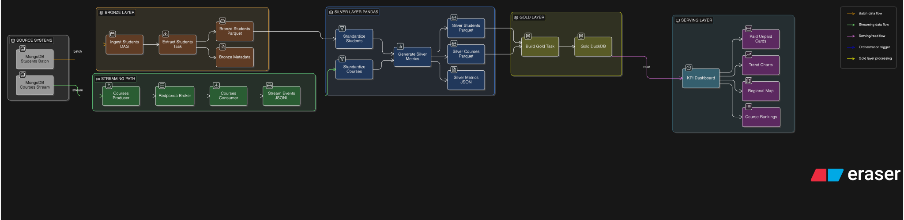

# Student Courses Data Engineering Pipeline

> "*Giving private tutors the KPIs they need*"

<video controls="controls" src="assets/dashboard_showcase.webm"></video>

## Table of Contents

---

- [Context](#20260501154856-43szmve)
- [KPIs covered](#20260501160823-io7b1lq)
- [Architecture](#20260501161807-dt7u3kq)
- [Technologies used](#20260501162505-zo3f8eo)
- [Download & setup](#20260501163321-3e5l72o)
- [Project Structure](#arch)

## <span id="20260501154856-43szmve" style="display: none;"></span>Context

---

A friend of mine owns a plateform that teachs students and preps them for the national exam. He published many courses. **But**, he lacked something pivotal for his business' growth, and that's **visibility**!

He didn't know which course is most demanded, per region. He had the data, but not the **information**.

As such, Halim Chaouch and I made this project.

## <span id="20260501160823-io7b1lq" style="display: none;"></span>KPIs covered

---

This pipeline's main goal is to compute my friend's KPIs, which are the following:

- Course enrollement by course name and region/date
- Students' paid rate by region
- Student's paid and unpaid rate by region/date

## <span id="20260501161807-dt7u3kq" style="display: none;"></span>Architecture

---

This project follows [medallion architecture](assets/diagram-export-20-04-2026-09_22_44-20260501231908-np3ok8k.svg), as seen bellow.



The bronze layer holds ingestion logic. We fetch from two mongodb collections: **Students** and **Courses** collections. Students are fetched regularily through batch ingestion, while Courses are fetched in real-time "streaming". *E*

The silver layer applies transformations. *T*

Then these transformed data are loaded in our production/gold database. *L*

Thus, we have *ETL* pipeline!

There's an additional layer called serving layer. It's responsible to display KPIs in gold layer database in beautful figures.

## <span id="20260501162505-zo3f8eo" style="display: none;"></span>Technologies used

---

|Tech|Reason|
| -------------------------| ------------------------------------------------------------------------------------------------------------------------------------|
|Pandas|The transformations are simple, and data aren't big. So no need to use Spark or Dask|
|Airflow|Used to orchastrate our DAGs.|
|Redpanda (kafka in c++)|For streaming, we needed publish/subscribe pattern. Redpanda is the more performant variant of kafka|
|DuckDB|We needed OLAP columnar Database. A lightweight, simple, yet powerful one.|
|Parquet|Simple alternative to big data warehouses in each layer. Our project is simple, so we opted for the simplest data storage approach|
|Streamlit|Straightforward and simple way to spin up dashboard website in python. Can host dashboard for free...|

## <span id="20260501163321-3e5l72o" style="display: none;"></span>Download & Setup

---

Clone this reposiotry with

```bash
git clone git@github.com:Mindblownserver/Student-Courses-Data-Engineering-Pipeline.git
```

Go to `Airflow Setup`​ and run the `airflow-compose.yaml` file

```bash
cd "Airflow Setup" && docker-compose -f airflow-compose up -d --build
```

If you have the new version of docker, then type `docker compose`​ instead of `docker-compose`.

Now you have your very own pipeline working :)

## <span id="arch" style="display: none;"></span>Project Structure

---

- ​`PHASE_04_BRONZE`

  This holds the DAG that responsible for bronze layer
- ​`PHASE_07_SERVING_STREAMING/streaming`

  This holds 2 python scripts: one for the Kafka producer, the other for the Kafka Consumer.  
  The sources don't support streaming, so we had a producer that polls the database ever X seconds and if it detects changes (thanks to watermark), we publish it to the message broker for the consumer to...consume.  
  The consmer part when it detects a new course, it will save it in `.jsonl` file. Now courses are ready to enter the silver layer
- ​`PHASE_05_SILVER`

  Holds logic behind silver layer's transformations.
- ​`PHASE_06_GOLD`

  Finally, when everything goes well, it creates the schema (if it didn't exist) and saves data there.
- ​`PHASE_07_SERVING_STREAMING/dashboard`

  It holds the intialization script for the streamlit dashboard

‍
